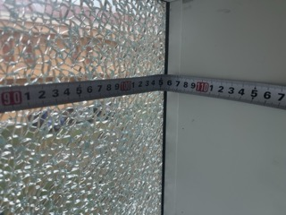
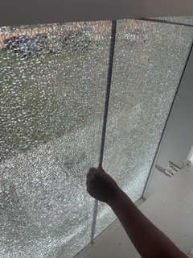
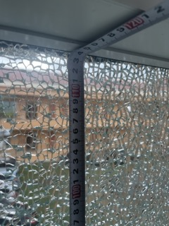

<h1 align="center">🪟 幕墙玻璃尺寸 🪟</h1>

***

<h2 align="center">A. 内径尺寸</h2>

**🏞️ 图1. 内径-长-全景**

***

**🏞️ 图2. 内径-长-特写**

***

**🏞️ 图3. 内径-宽-全景**

***

**🏞️ 图4. 内径-宽-特写**

***

<h2 align="center">B. 外径尺寸</h2>

**🏞️ 图5. 外径-长-全景**

***

**🏞️ 图6. 外径-长-特写**

***

**🏞️ 图7. 外径-宽-全景**

***

**🏞️ 图8. 外径-宽-特写**